# MergePhotos #

Android application for merging photos.
Internaly it uses OpenCL.

* [Panorama](#panorama)
* [Aligned](#aligned)
* [HDR](#hdr)
* [Long Exposure](#long-exposure)
* [Interpolation](#interpolation)

[Ideas](#ideas):
* [Inpaint](#inpaint)
* [Long exposure improuvements](#long-exposure-improuvements)

## Panorama ##

Needs minimum 2 photos.

Input Image 1 | Input Image 2
--- | ---
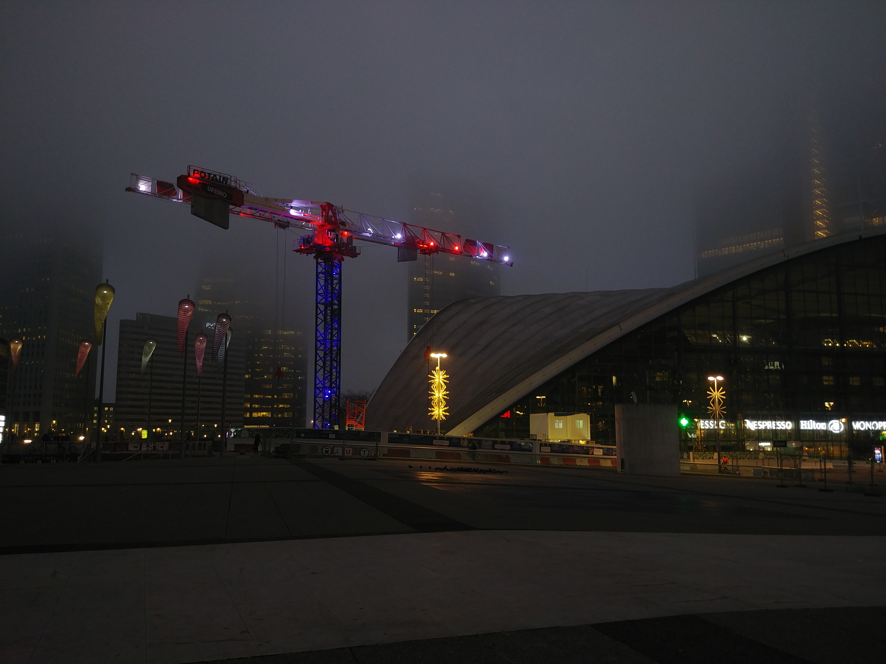 | 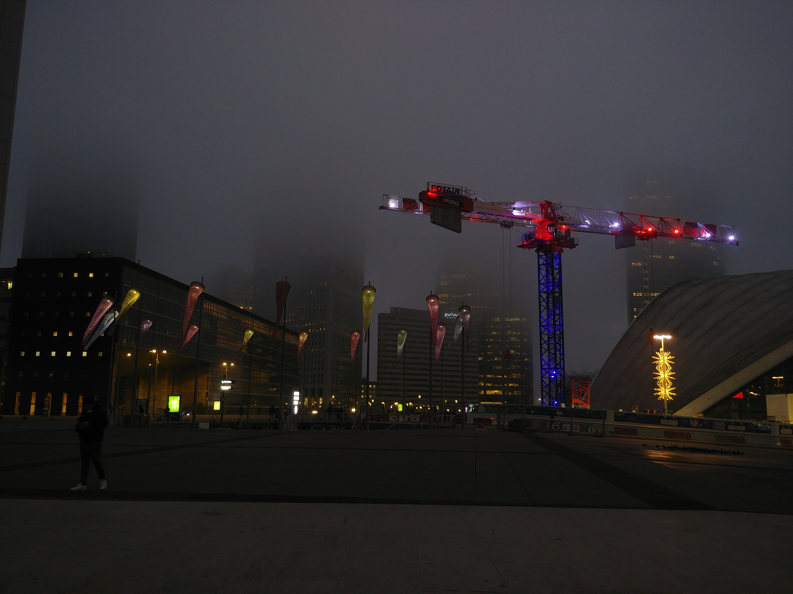

Panorama: Plane | Panorama: Cylindrical | Panorama: Spherical
--- | --- | ---
 | 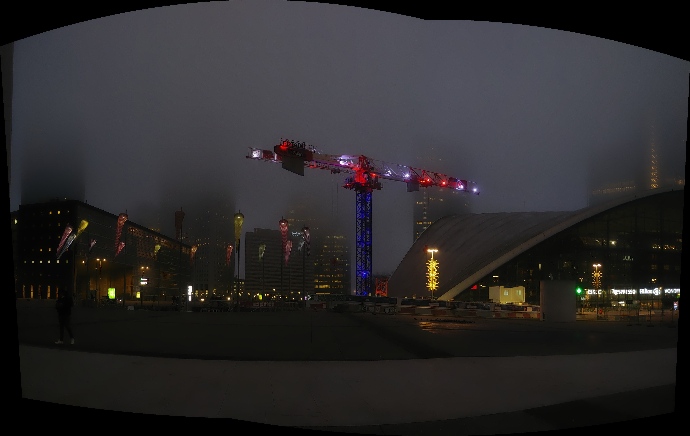 | 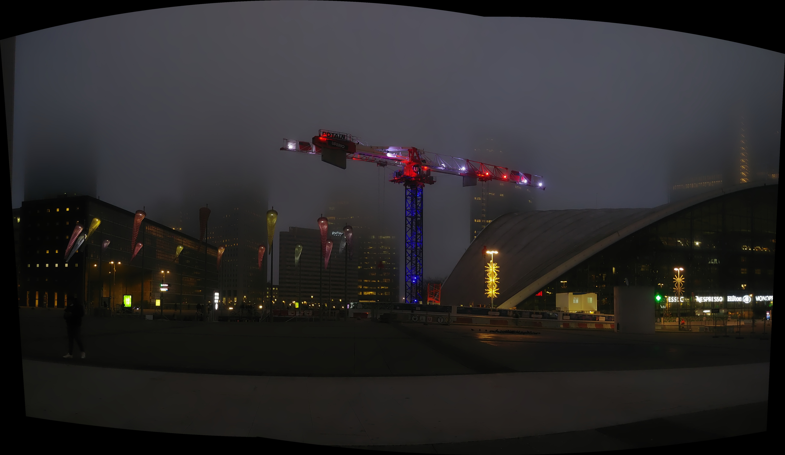

## Aligned ##

Images are aligned based on the first image. Aligned images will fill with black missing pixels.

Input Image 1 | Input Image 2 | Input Image 3
--- | --- | ---
 |  | 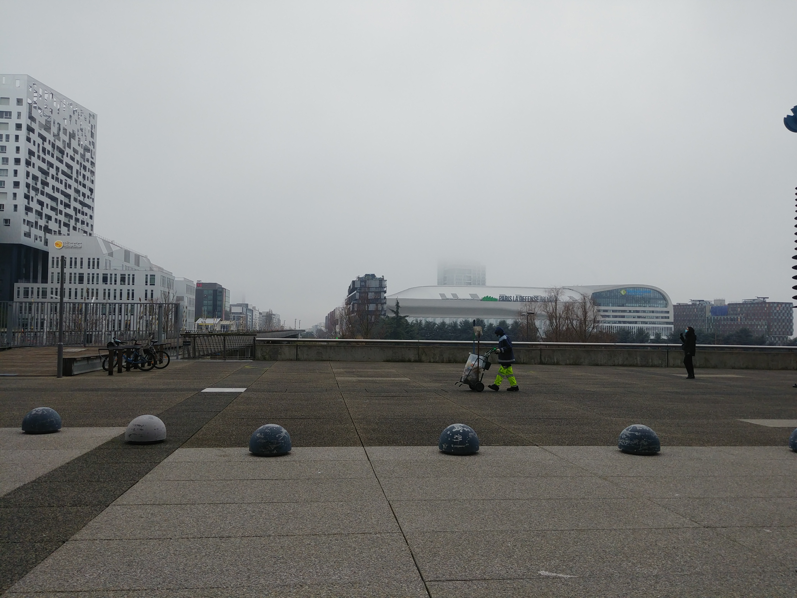

Output Image 1 (the same) | Output Image 2 | Output Image 3
--- | --- | ---
 | 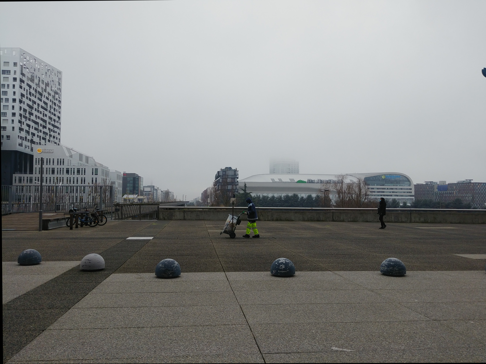 | 

## HDR ##

Images are aligned before merging.

Input Image 1 | Input Image 2 | Input Image 3
--- | --- | ---
 |  | 

Output

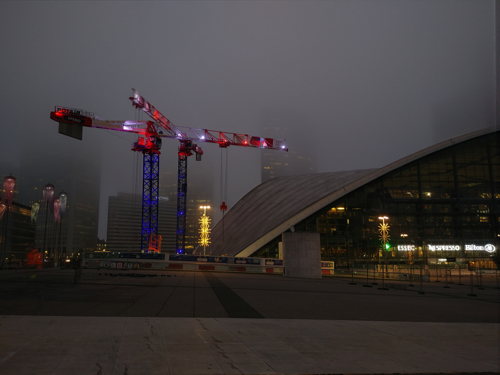

## Long Exposure ##

Images are aligned before merging.
Modes:
* Average: will make changes looks like ghosts.
* Nearest to Average (minimum 3 images): will make changes disapear.
* Farthest from Average (minimum 3 images): will make all changes apear in the final photo.

Input Image 1 | Input Image 2 | Input Image 3
--- | --- | ---
 |  | 

Average | Nearest to Average | Farthest from Average
--- | --- | ---
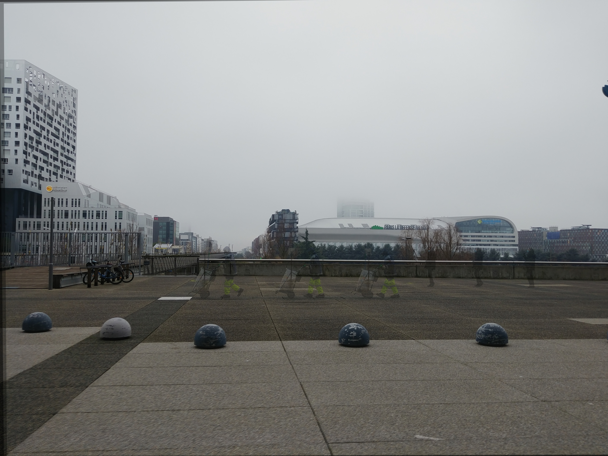 | 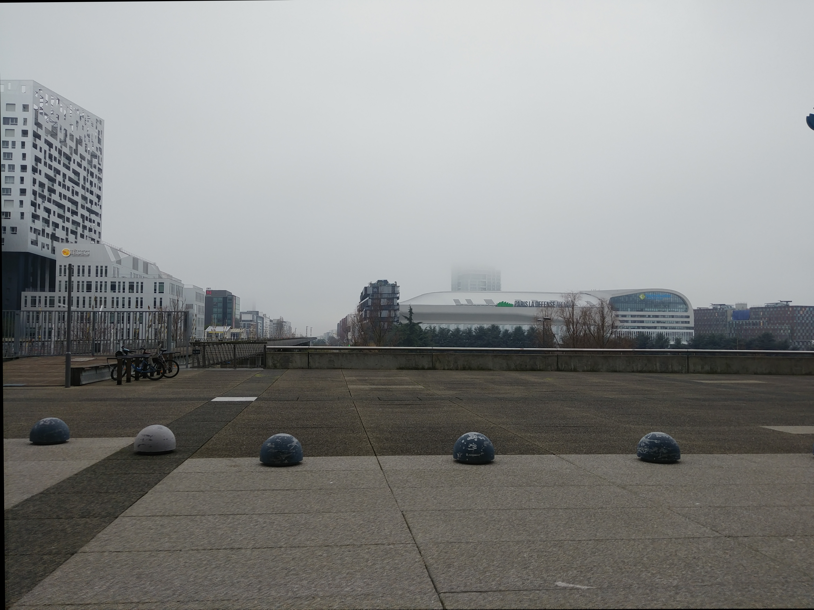 | 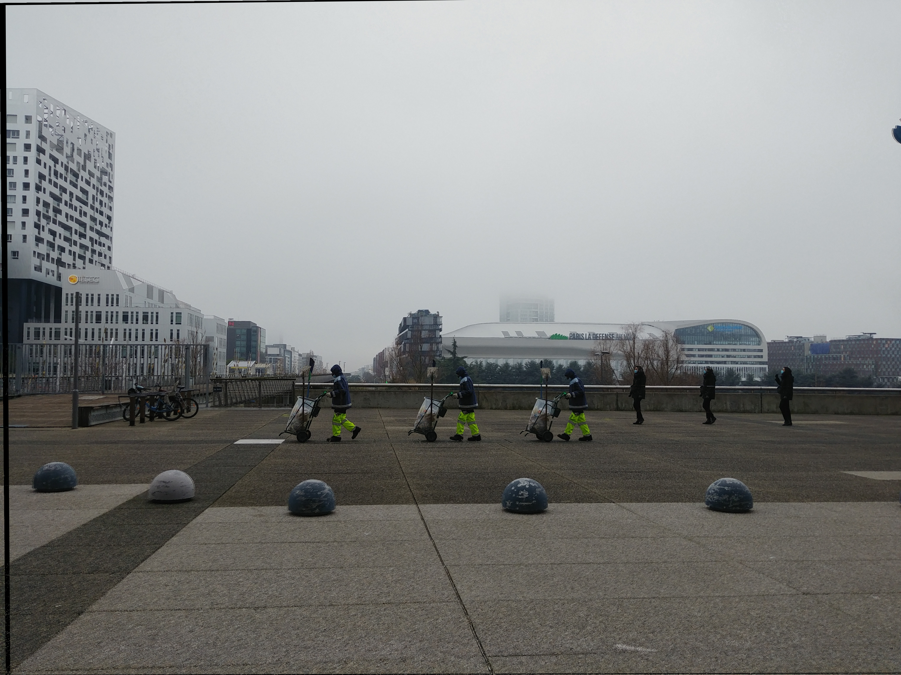

## Interpolation ##

Linear (default) | Cubic | Area | Lanczos4
--- | --- | --- | ---
 |   |  | 

Lanczos4 looks to be the sharpest so I will switch from default to this one.

# Ideas #

## Inpaint ##

When creating panoramas the result images have black borders.

Panorama | Mask
--- | ---
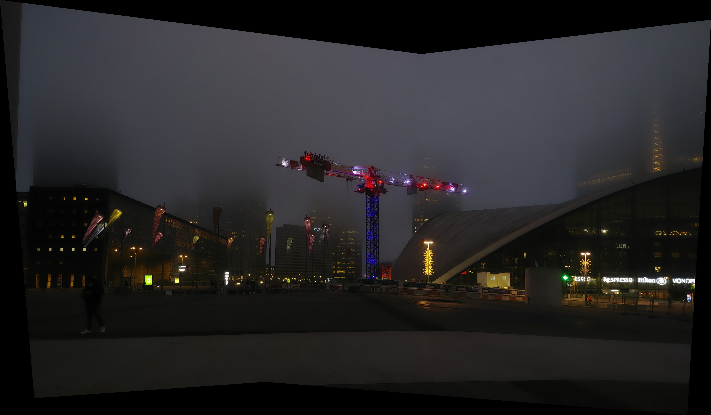 | 

I tested opencv / opencv_contrib to fill this areas (the time it took is on my laptop not on adroid device):

Inpaint NS | Inpaint TELEA | xphoto::inpaint SHIFTMAP | xphoto::inpaint FSR FAST | xphoto::inpaint FSR BEST
--- | --- | --- | --- | ---
4.57 seconds | 4.04 seconds | 22.68 seconds | 190.09 seconds | 3086.39 seconds
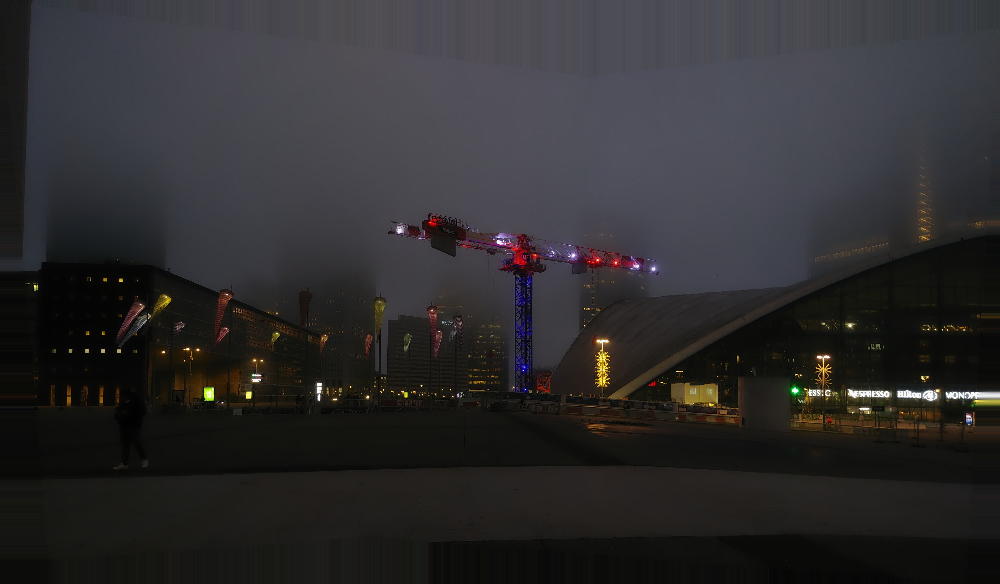 | 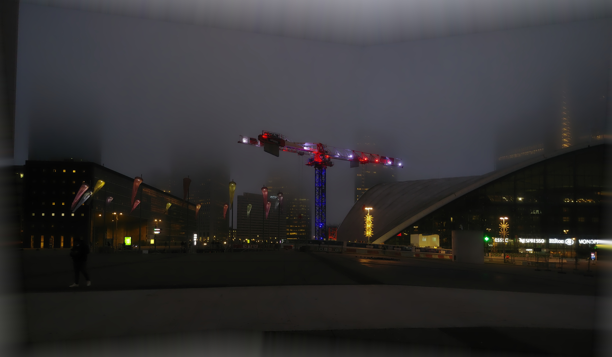 | 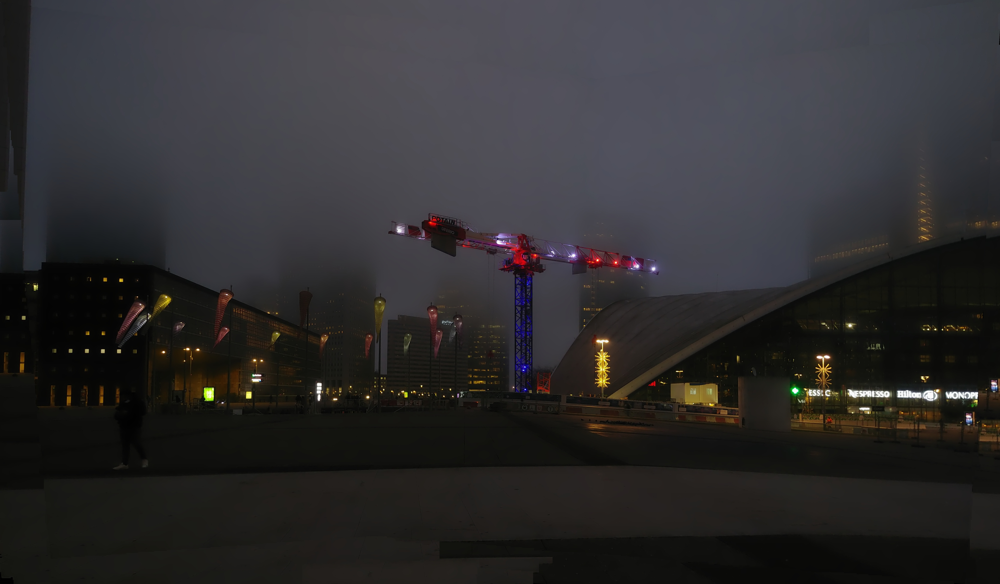 |  | 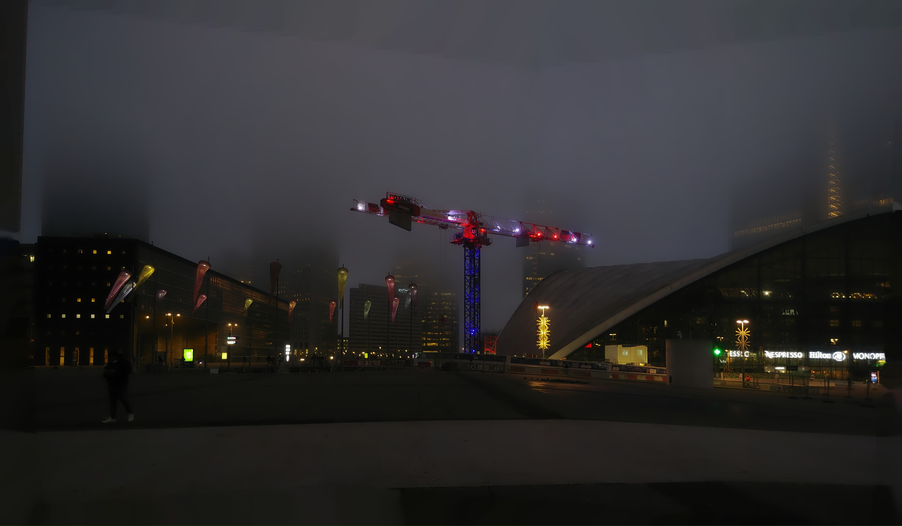

From my point of view:
* SHIFTMAP: looks the best (at leat for my test images) but seems a little too slow for a android (to be tested)
* NS: looks OK and the time is decent
* TELEA: doesn't look great
* FSR (FAST & BEST): are too slow

## Long exposure improuvements ##

If you capture 2-3 images of a waterfall the water don't look blurry enought.
Try to add some blur / motion blur on areas that are different.
(I Need so take some interesting shots first.)
