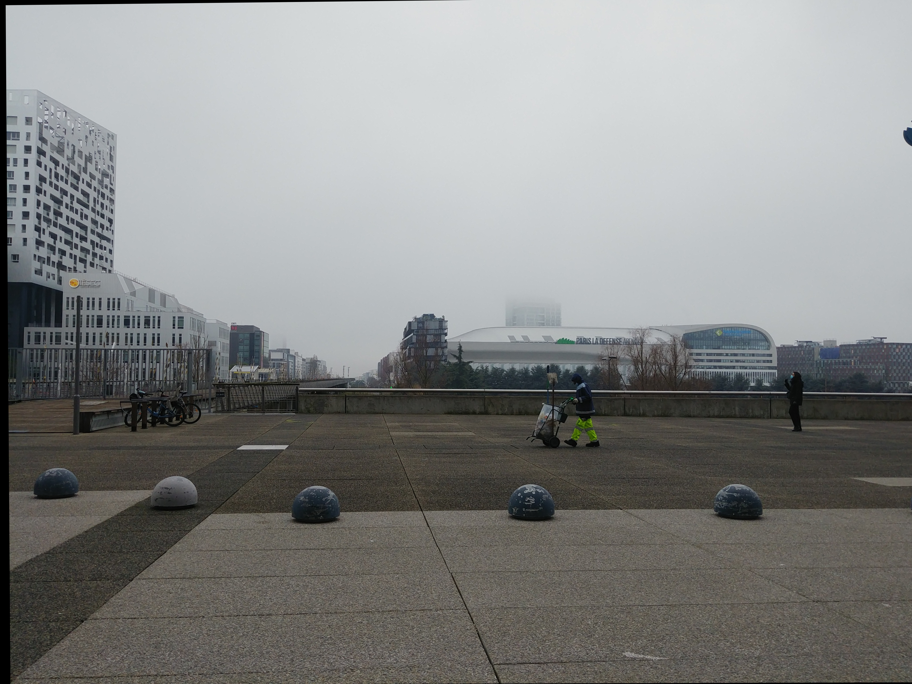

# MergePhotos #

Android application for merging photos.
Internaly it uses OpenCL.

* [Panorama](#panorama)
* [Aligned](#aligned)
* [HDR](#hdr)
* [Long Exposure](#long-exposure)

## Panorama ##

Needs minimum 2 photos.

Input Image 1 | Input Image 2
--- | ---
 | 

Panorama: Plane | Panorama: Cylindrical | Panorama: Spherical
--- | --- | ---
 |  | 

## Aligned ##

Images are aligned based on the first image. Aligned images will fill with black missing pixels.

Input Image 1 | Input Image 2 | Input Image 3
--- | --- | ---
 |  | 

Output Image 1 (the same) | Output Image 2 | Output Image 3
--- | --- | ---
 |  | 

## HDR ##

Images are aligned before merging.

Input Image 1 | Input Image 2 | Input Image 3
--- | --- | ---
 |  | 

Output

## Long Exposure ##

Images are aligned before merging.
Modes:
* Average: will make changes looks like ghosts.
* Nearest to Average (minimum 3 images): will make changes disapear.
* Farthest from Average (minimum 3 images): will make all changes apear in the final photo.

Input Image 1 | Input Image 2 | Input Image 3
--- | --- | ---
 |  | 

Average | Nearest to Average | Farthest from Average
--- | --- | ---
 |  | 
